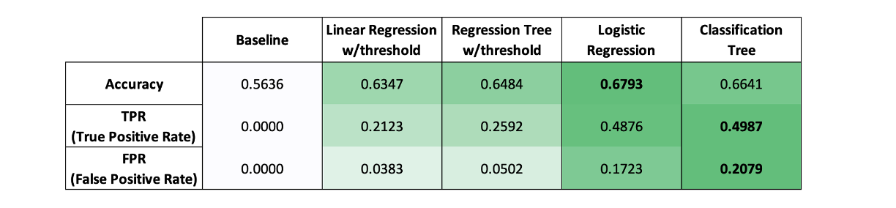
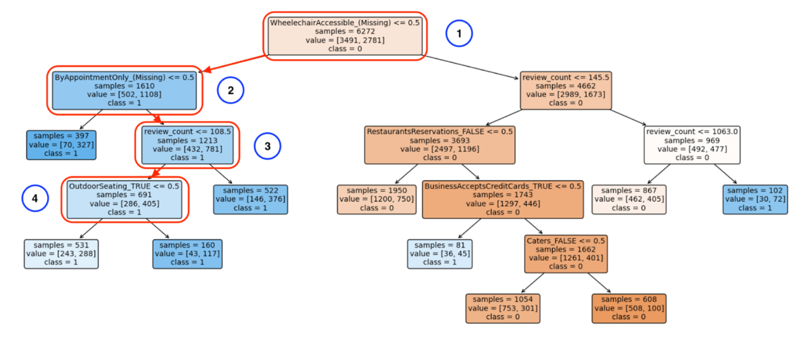

# Predicting Yelp Ratings: An Analytical Approach

## Introduction

In the competitive restaurant industry, achieving and maintaining high Yelp ratings is crucial for attracting customers and ensuring business success. This analysis focuses on predicting the star ratings of restaurants in Las Vegas, Nevada, using various regression and classification models. By understanding the factors that influence these ratings, restaurants can take actionable steps to improve their standings on Yelp.

## Data Overview

The dataset consists of restaurant profiles from Yelp, including attributes such as average star rating, number of reviews, and various categorical features. The data is split into training (6272 observations) and test sets (2688 observations).

## Dealing with Missing Values

One of the initial challenges was handling missing values. Given that all attribute features contain missing values, we treated "(Missing)" as an explicit category. This approach preserves the information that these values are missing, allowing the model to capture patterns associated with the absence of information.

## Modeling Strategy

### Linear Regression

We started with a linear regression model using all provided features. The reference level for each categorical variable was set to "(Missing)" to ensure a cleaner interpretation.

```python
import pandas as pd
import statsmodels.formula.api as smf

# Load training data
train_data = pd.read_csv("yelp242a_train.csv")

# Fit linear regression model
linreg = smf.ols(formula='stars ~ review_count + C(attribute1, Treatment(reference="(Missing)")) + ...', data=train_data).fit()
print(linreg.summary())
```
### Regression Tree

Next, we built a regression tree model using the CART algorithm. We performed cross-validation to select the optimal complexity parameter (ccp_alpha).

```python
from sklearn.tree import DecisionTreeRegressor
from sklearn.model_selection import GridSearchCV

# Initial tree model
tree = DecisionTreeRegressor(ccp_alpha=0.01, min_samples_leaf=5)
tree.fit(train_data.drop('stars', axis=1), train_data['stars'])

# Cross-validation to find optimal ccp_alpha
param_grid = {'ccp_alpha': np.linspace(0, 0.1, 201)}
grid_search = GridSearchCV(tree, param_grid, cv=5)
grid_search.fit(train_data.drop('stars', axis=1), train_data['stars'])
best_tree = grid_search.best_estimator_
```

### Evaluation of Regression Models

The models were evaluated using the test set, and the OSR² and MAE metrics were computed. The regression tree with cross-validation performed slightly better than the linear regression model.

### Classification Approach

Recognizing that restaurants might be more concerned with achieving high ratings, we shifted our focus to a classification problem. We created a new variable, **fourOrAbove**, indicating whether a restaurant's star rating is 4 or above.

```python
# Creating the fourOrAbove variable
train_data['fourOrAbove'] = (train_data['stars'] >= 4).astype(int)
test_data['fourOrAbove'] = (test_data['stars'] >= 4).astype(int)
```

### Logistic Regression
We built a logistic regression model using all independent variables, with "(Missing)" as the reference level.

```python
# Fit logistic regression model
logreg = smf.logit(formula='fourOrAbove ~ review_count + C(attribute1, Treatment(reference="(Missing)")) + ...', data=train_data).fit()
print(logreg.summary())
```

### Classification Tree
A classification tree was constructed, with hyperparameters selected through cross-validation.

```python
from sklearn.tree import DecisionTreeClassifier

# Initial classification tree model
clf_tree = DecisionTreeClassifier(ccp_alpha=0.01, min_samples_leaf=5)
clf_tree.fit(train_data.drop('fourOrAbove', axis=1), train_data['fourOrAbove'])

# Cross-validation for optimal parameters
param_grid = {'ccp_alpha': np.linspace(0, 0.1, 201)}
grid_search = GridSearchCV(clf_tree, param_grid, cv=5)
grid_search.fit(train_data.drop('fourOrAbove', axis=1), train_data['fourOrAbove'])
best_clf_tree = grid_search.best_estimator_
```

### Model Performance Comparison

The performance of all models was compared using accuracy, TPR, and FPR metrics. Logistic Regression and Classification Trees showed better performance compared to simpler models.



## Recommendations for Restaurants
Based on the analysis, here are three actionable tips for Las Vegas restaurants to achieve a high star rating on Yelp:

1. **Ensure Accessibility**: Being wheelchair accessible significantly increases the likelihood of receiving a star rating of four or above.
2. **Provide Reservation Options**: Offering reservation options can enhance the dining experience and potentially result in higher ratings.
3. **Emphasize Outdoor Seating**: Providing outdoor seating options can positively influence ratings.

By focusing on these areas, restaurants can improve their overall customer experience and increase their chances of receiving higher ratings on Yelp.



## Conclusion
This analysis demonstrates the importance of using machine learning models to predict Yelp ratings and provides actionable insights for restaurants. By understanding and implementing the key factors that influence ratings, businesses can enhance their reputation and attract more customers.

## Acknowledgements

This project was developed as part of a course at IEOR Department at UC Berkeley. Special thanks to Professor Paul Grigas and his team for their guidance and support.
